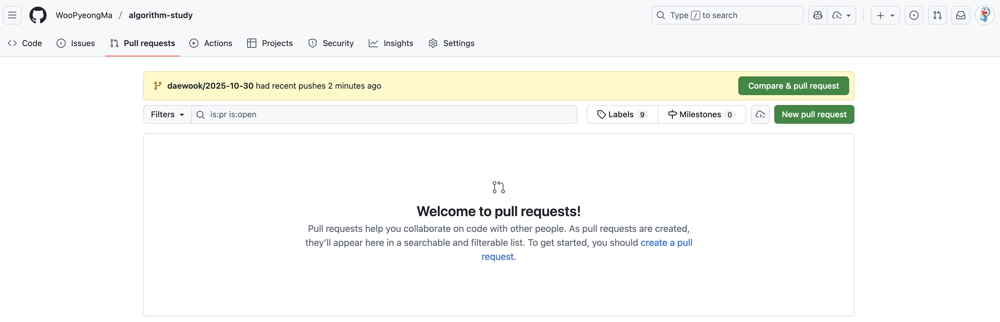
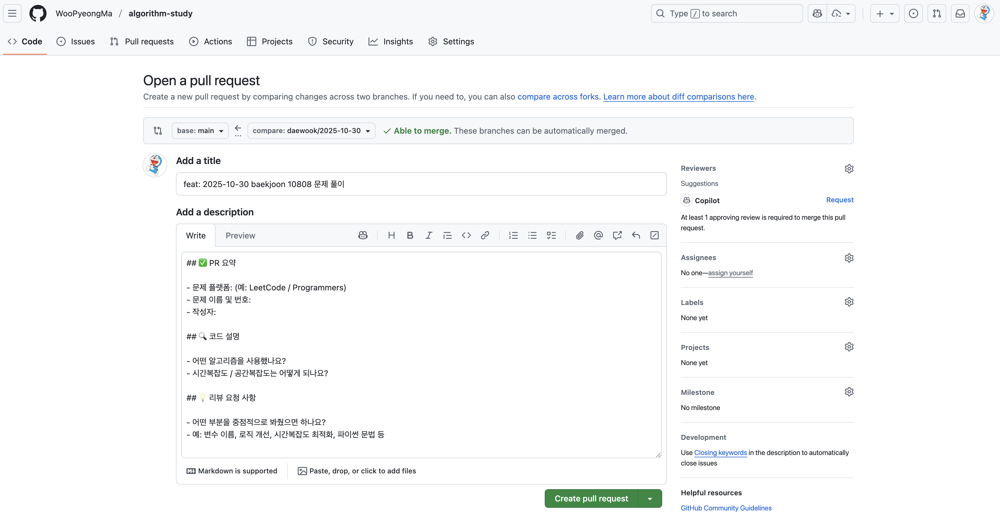
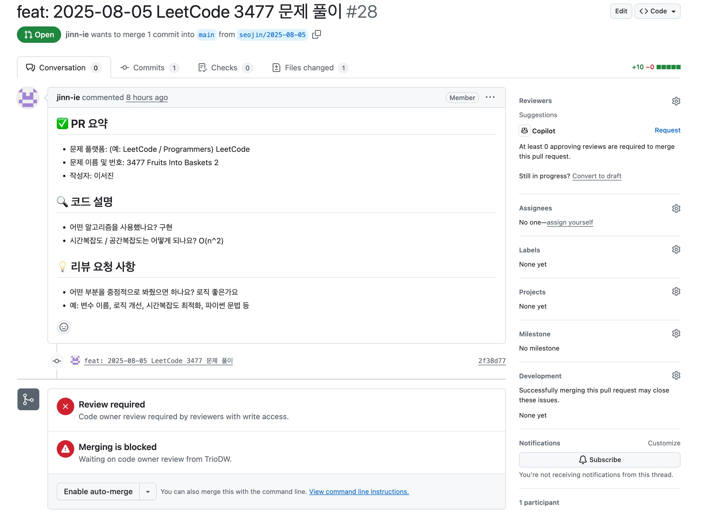
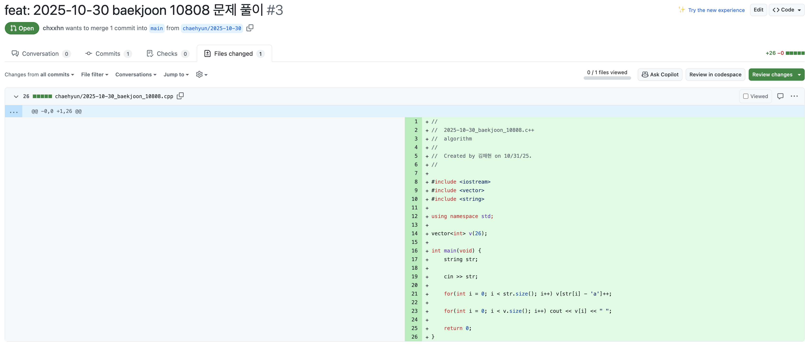
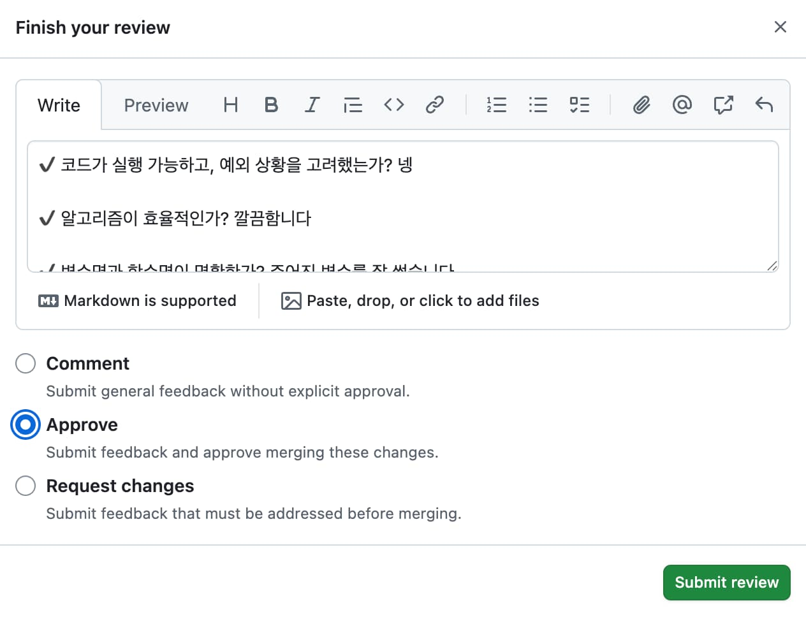
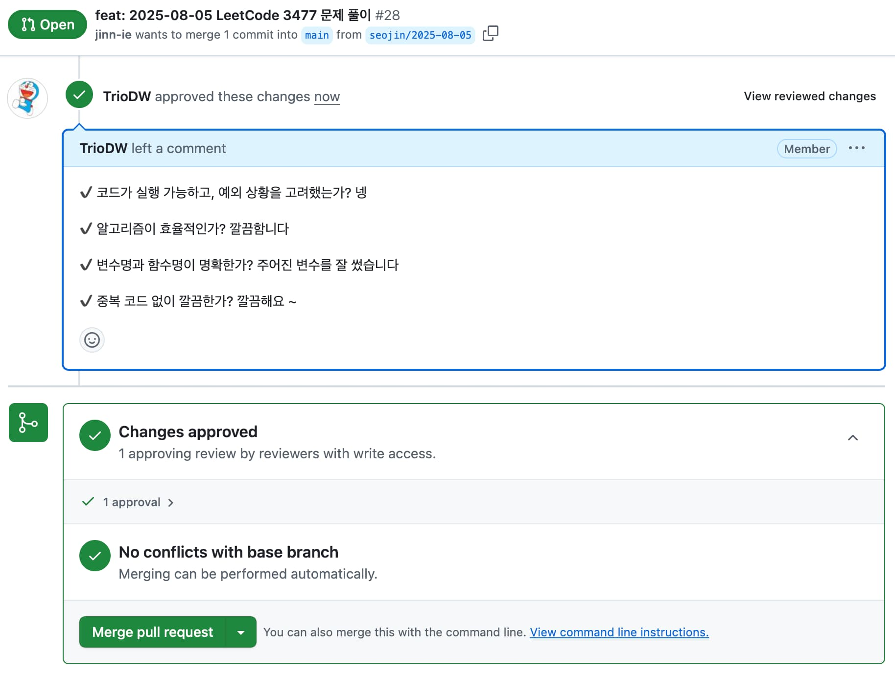
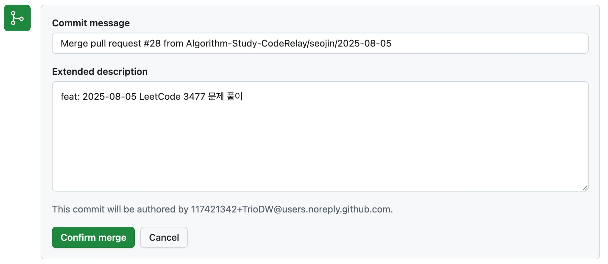
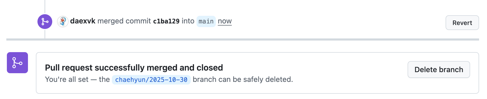

# 알고리즘 스터디

## 📁 폴더 구조

```
algorithm-study/
├── daewook/
│ ├── 2025-10-30_leetcode_123.py
│ └── ...
├── chaehyun/
│ ├── 2025-10-30_programmers_456.py
│ └── ...
```

- 각자의 폴더에 파일을 저장합니다.
- 파일 이름은 다음과 같이 작성합니다: `YYYY-MM-DD_플랫폼_문제이름.py`  
  예: `2025-10-30_leetcode_123.py`

## 브랜치 / PR / 리뷰 진행 방식

1. **브랜치 생성**

   ```bash
   git checkout main
   git pull origin main
   git checkout -b daewook/2025-10-30
   ```

2. **문제 풀이 파일명**

   ```bash
   daewook/2025-10-30_leetcode_123.py
   ```

3. **커밋 & 푸시**

   ```bash
   git add .
   git commit -m "feat: 2025-10-30 LeetCode 123 문제 풀이"
   git push origin daewook/2025-10-30
   ```

4. **GitHub에서 PR 생성** : PR을 만들면 자동으로 PR 템플릿이 생성되며, 문제 요약, 코드 설명, 리뷰 요청사항을 작성합니다.
<div align="center">
   
</div>
<div align="center">
   
</div>
<div align="center">
   
</div>

5. **코드 리뷰**: Reviewer는 **Files changed**로 이동한 후, **Review changes**를 누르고, 아래 리뷰 시 고려할 사항을 복사하여 붙여놓고 리뷰를 진행합니다.

<div align="center">
   
</div>

- 리뷰 시 고려할 사항

  ```
  ✔ 코드가 실행 가능하고, 예외 상황을 고려했는가?
  ✔ 알고리즘이 효율적인가?
  ✔ 변수명과 함수명이 명확한가?
  ✔ 중복 코드 없이 깔끔한가?
  ```

- 그후, **Approve**를 체크한 후, **Submit review** 버튼을 눌러 리뷰를 제출합니다.

<div align="center">
   
</div>

6. **Merge** : **PR 작성자가 Merge**를 진행합니다.

<div align="center">
   
</div>

- PR 작성자는 코드 리뷰를 기다립니다.
- Reviewer가 리뷰를 작성했을 경우, **Merge pull request** 버튼이 활성화되며, 리뷰를 확인하고 버튼을 클릭합니다.

<div align="center">
   
</div>
<div align="center">
   
</div>

- **Confirm merge** 버튼을 클릭하여 Merge를 진행하고, **Delete branch**를 통해 브랜치 삭제를 진행합니다.

- PR 작성자는 `main` 브랜치를 pull 받아 로컬을 최신 상태로 유지합니다

  ```bash
  git checkout main
  git pull origin main
  ```

<!--PR_TABLE_START-->
| Date       | <br/>Chxxhn | <br/>Daexvk |
|------------|:---:|:---:|
| 2025-10-26 | ❌ | ❌ |
| 2025-10-27 | ❌ | ❌ |
| 2025-10-28 | ❌ | ❌ |
| 2025-10-29 | ❌ | ❌ |
| 2025-10-30 | ❌ | ✅ |
| 2025-10-31 | ✅ | ✅ |
| 2025-11-01 | ❌ | ✅ |
| 2025-11-02 | ❌ | ✅ |
| 2025-11-03 | ❌ | ✅ |
| 2025-11-04 | ✅ | ✅ |
| 2025-11-05 | ✅ | ✅ |
| 2025-11-06 | ✅ | ✅ |
| 2025-11-07 | ✅ | ✅ |
| 2025-11-08 | ❌ | ❌ |
| 2025-11-09 | ❌ | ❌ |
<!--PR_TABLE_END-->
